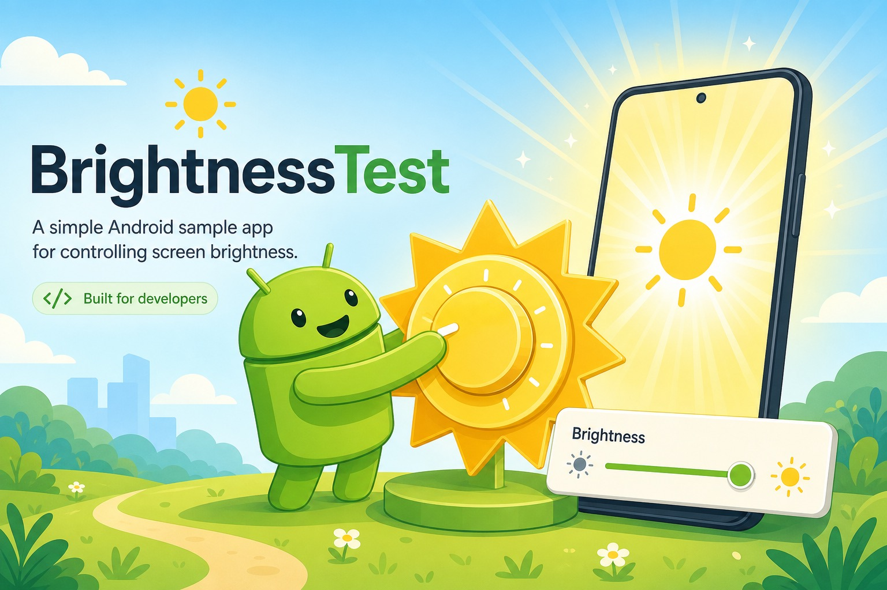

# BrightnessTest

    



A minimal legacy Android sample app (circa 2017) that demonstrates how to control screen brightness programmatically. It is a stock Android Studio "Basic Activity" template with a small brightness experiment added to `MainActivity`.

## What It Does

On launch, `MainActivity`:

1. Writes the system-wide brightness setting to its maximum value (255) via `Settings.System.putInt(..., SCREEN_BRIGHTNESS, ...)` — this requires the `WRITE_SETTINGS` permission declared in the manifest.
2. Sets the current window's brightness to maximum through `WindowManager.LayoutParams.screenBrightness`.

The rest of the app (toolbar, FAB with a placeholder Snackbar, options menu, "Hello World!" layout) is unmodified template code.

## Requirements

- Built against compileSdkVersion 23 / buildToolsVersion 23.0.1
- Android Gradle Plugin 1.3.0, Android Support Library 23.1.0 (appcompat-v7, design)
- minSdkVersion 10, targetSdkVersion 23

These toolchain versions are from the 2015–2017 era and will not build with a modern Android Studio setup without migration (AndroidX, current AGP, Maven Central instead of JCenter).

## Project Structure

```
app/src/main/java/com/zyxw/myapplication/MainActivity.java  # Brightness logic
app/src/main/AndroidManifest.xml                            # WRITE_SETTINGS permission
app/src/main/res/                                           # Template layouts and resources
```

## Status

This repository is a one-off test/sample and is not maintained. Note that on Android 6.0+ (API 23), writing `Settings.System` requires the user to grant the `WRITE_SETTINGS` special permission via `Settings.ACTION_MANAGE_WRITE_SETTINGS`, which this sample does not handle.
